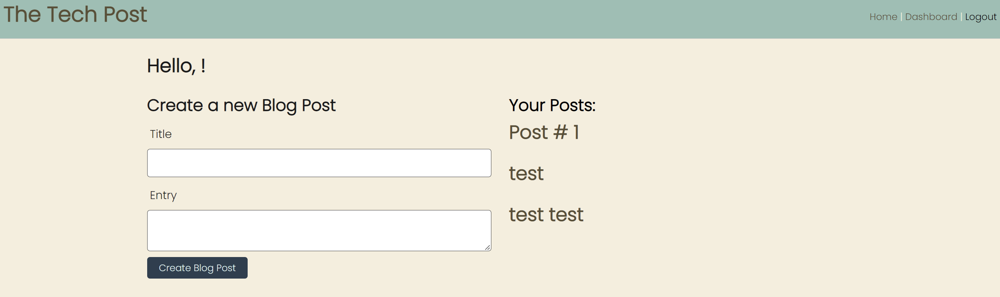

# The Tech Post

  ----
  

  ----

### Description
It is a blog site that allows you to create and edit posts as well as leave comments on the site.

## Table of Contents
- [Installation](#installation)
- [Usage](#usage)
- [Pictures](#pictures)
- [License](#license)
- [Contribution](#contribution)
- [Test Instructions](#test-instructions)
- [Questions](#questions)

### Installation
Clone or download the repo.  You will also need to install and download node.js and Insomnia to run and test the program.

### Usage
Run npm install in node.   Log into mysql and source db/schema.sql.   Run npm seed in node.  Run npm start or node server.js in your node terminal.  Then check your routes via your favorite browser or Insomnia. 

### Pictures

### License
MIT
https://choosealicense.com/licenses/mit/

### License Details

MIT License

### Contribution
niccolosaurus(Niccolo Eck)

### Test-Instructions
n/a

### Questions
[Github Profie](https://github.com/niccolosaurus) 
https://niccostechblog.herokuapp.com/ 
nicco.eck@gmail.com 

